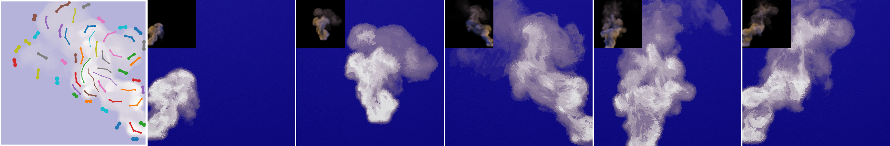

# StrokeTransferForParticipatingMedia

This is the official code release for our **SIGGRAPH 2025** paper:<br/>
**"Stroke Transfer for Participating Media"**

<p align="center">
  
  
  
</p>

<div align="center">  

[](http://cg.it.aoyama.ac.jp/yonghao/sig25/abstsig25.html)
[](http://cg.it.aoyama.ac.jp/yonghao/sig25/Stroke_transfer_for_participating_media.pdf)
[](https://youtu.be/6Zl75Vep0p4)

</div>

## Setup and Installation

### Requirements

- Tested on **macOS** (Intel & Apple Silicon)
- [Anaconda](https://www.anaconda.com/) with Python 3.10
- C++ compiler (recommended: `clang++` or Xcode Command Line Tools)
- [CMake ≥ 3.16](https://cmake.org/)

### C++ Dependencies (macOS)

Install required libraries:

```bash
brew install eigen hdf5 libpng glew glfw boost glm
```

> These libraries will be automatically detected via CMake.

### Step-by-Step Installation

```bash
# Clone the repository
git clone https://github.com/AGU-Graphics/StrokeTransferForParticipatingMedia.git
cd StrokeTransferForParticipatingMedia
```

#### Option 1: Using Conda (recommended for full reproducibility)

```bash
# This will build the C++ tools and create the conda environment automatically
python setup.py --env conda

# After setup, activate the environment manually
conda activate stroke_transfer_pm
```

#### Option 2: Using pip + venv (or conda-based pip environment)

```bash
# (1) Create and activate your Python environment

# Example using venv:
python -m venv stroke_transfer_pm
source stroke_transfer_pm/bin/activate  # On Windows: stroke_transfer_pm\Scripts\activate

# Or using conda:
conda create -n stroke_transfer_pm python=3.10
conda activate stroke_transfer_pm

# (2) Run the setup script with pip option
python setup.py --env pip
```

### What this script does

Whether you use `--env conda` or `--env pip`, this script will:

- Build the C++ tools using CMake and Make
- Create symbolic links for executables under `code/cpp_tools/bin/`

Depending on the environment option:

- `--env conda`: Creates a Conda environment using `environment.yml`
- `--env pip`: Installs Python dependencies from `requirements.txt` into the current environment

> **Tip**: Be sure to activate your environment **before** running `setup.py --env pip`.

---

## Example Assets

We provide example assets under `assets` for quick testing of the pipeline.

These include exemplar images, annotations, textures, and a scene-specific configuration.

### [assets/RisingSmoke](assets/RisingSmoke)




### Note:

> - Volume data is hosted in external repositories listed in `volume_data_repositories.json`. o simplify setup, the script automatically downloads the required data—no manual cloning is needed.
> - All released scenes use downsampled volume data to reduce storage size, which may slightly affect computed features and selected exemplar frames.
> - Currently, only `RisingSmoke` is available. More scenes will be added over time, along with updates to `volume_data_repositories.json`.
---

## Running the Pipeline

### Step 1: Set Up Volume Data

From the `output/` directory, run:

```bash
python setup_scene.py RisingSmoke
```

This will prepare the scene as follows:

- Create the output directory: `output/RisingSmoke/`
- Create a symbolic link: `output/RisingSmoke/assets → ../assets/RisingSmoke/`
- Clone the external volume data (~1.3 GB) into: `assets/RisingSmoke/volume_data/`

> Volume repository URLs are listed in volume_data_repositories.json.
> For more details, see: [Pipeline Overview](docs/pipeline_overview.md)

---

### Step 2: Run the Full Pipeline

Once the volume data is in place, run:

```bash
python run.py --scene_names RisingSmoke --frame_start 108 --frame_end 120 --frame_skip 6
```

This will process the scene and generate stroke rendering results for frames 108, 114 and 120.

The final outputs will appear in:

```
output/RisingSmoke/final/
```

By default, the pipeline also generates intermediate data under:

- `temp/` – raw features, basis, and attributes
- `log/` – pipeline logs

Additional plots (e.g., feature/basis/attribute visualizations) are stored under `plot/` **only if** the `--plot` option is enabled.

---

### Directory Structure

```text
assets/[scene_name]/         # Read-only input data and config
├── exemplar/                # Exemplar images and annotations
├── textures/                # Texture maps used for rendering
├── volume_data/             # Input volume data for feature computation
└── pipeline_settings.json   # Scene-specific pipeline configuration

output/[scene_name]/         # Working directory
├── assets/                  # Symlink to assets/[scene_name]
├── temp/                    # Intermediate data: raw_features, basis, etc.
├── final/                   # Final strokes, models, and rendered videos
├── plot/                    # Supplemental visualizations
└── log/                     # Log outputs
```

---

### Further Documentation

#### Reference Docs 
- [Pipeline Overview](docs/pipeline_overview.md)
- [pipeline_settings.json Format](docs/pipeline_settings_format.md)

#### Tutorials & Examples
- [Exemplar Frame Estimation](docs/exemplar_frame_estimation.md)

## Citing

If you find **"Stroke Transfer for Participating Media"** useful in your research or projects, please consider citing it using the following BibTeX entry:

```bibtex
@inproceedings{ST:2025,
        author = {Shirashima, Naoto and Todo, Hideki and Yamaoka, Yuki and Kaji, Shizuo and Kobayashi, Kunihiko and
                        Shimotahira, Haruna and Yue, Yonghao},
        title = {Stroke Transfer for Participating Media},
        booktitle = {SIGGRAPH '25 Conference Proceedings},
        year = {2025},
        pages = {1--12},
        numpages = {12},
        doi = {10.1145/3721238.3730603}
    }
```